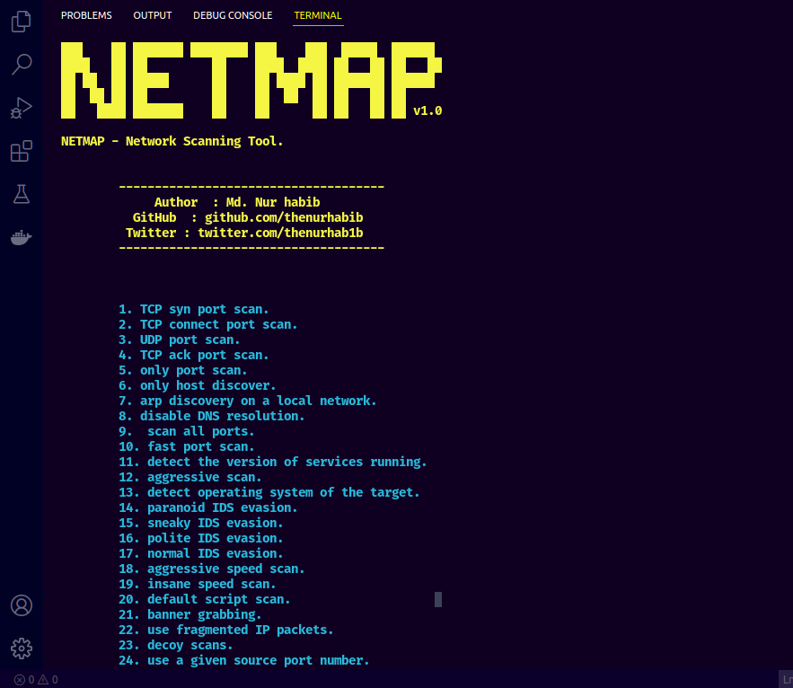

 <br> 


# NetMap

### Netmap is a network scanning tool with nmap. Just run this script and select an option whice one you want to use.


#### Disclaimer : This script is made for only educational purpose and legal usage, don't use without any legal permession.


## Badges


[](https://opensource.org/licenses/)

<br>


## Usage :
### Download & Install : 
```git clone https://github.com/thenurhabib/netmap```

```cd netmap```

```chmod 777 install.sh```

```./install.sh```

```python3 dorcker.py```


## Screenshot




## 🔗 Links
[](https://www.nurhabib.ml/)


[](https://twitter.com/mdnurhabib)


## 🚀 About Me
I'm a programmer.


## Author

- [@Md. Nur habib](https://www.github.com/nurhabib1)

